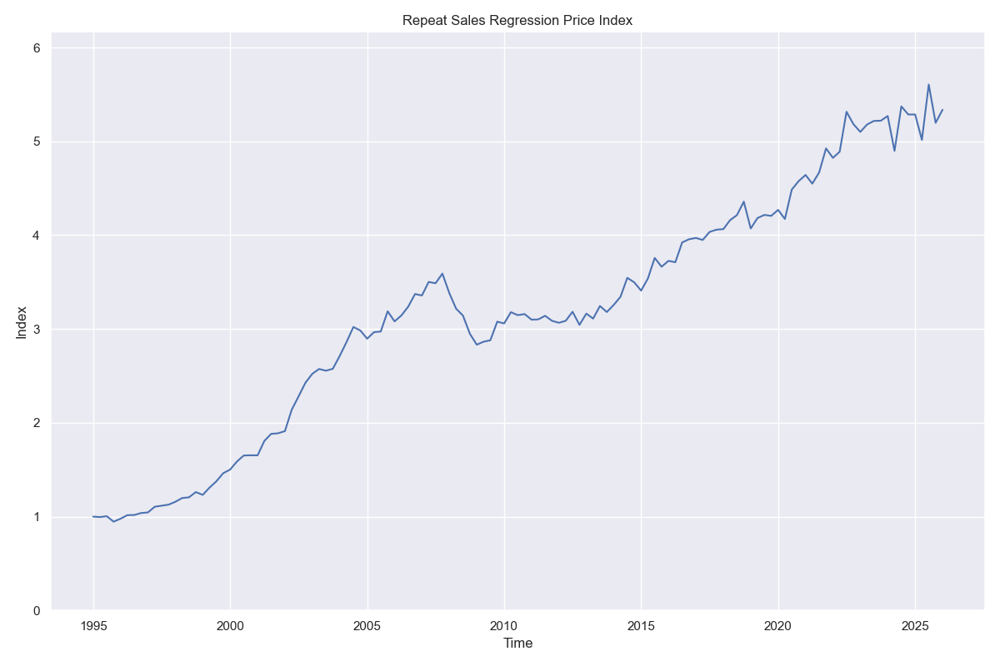

# Repeat Sales Regression

Repeat Sales Regression is a method used to derive a house price index (HPI) based on property sale prices.
The method is suitable for calculating an index for any heterogeneous, rarely traded asset class, provided repeat sales of any given asset can be derived.

The regression generates a timeseries of index values, however time itself is used as continuous numeric regressior.
Instead time is represented through a set of dummy variables indexed by period, and the regression coefficients on those dummies are the price index values.

The core assumption is that the value of a property at time $t$ is a proportional to the HPI for the given area at time $t$, and that all property values rise and fall through time according to the underlying HPI.
The difference in the logarithms of consecutive sales prices for a given property should therefore be the difference in logarithm of the index values ($I = ln(HPI)$) at the two sale periods:

$$ln(P_{t2})-ln(P_{t1}) = I_{t2} - I_{t1} + \epsilon$$

$\epsilon$ is the the error terms, and can be accounted for largely by market inefficiencies and properties undergoing upgrades or downgrades in between transactions. 
The design matrix for the linear model is all zeros, with a $-1$ and $+1$ in each row, positioned so as to pick out the relevant two index values for each repeat sales pair from the vector of parameters.
The first column of the design matrix is removed in order to constrain the solution such that all index parameters are relative to an initial value of $0$.
In order to recover the HPI from the regression we simply exponentiate the set of regression parameters.

A single data point in RSR is therefore given by the difference in the logarithms of two consecutive sale prices.
A dataset of repeat sale pairs can be derived from a dataset of transactions, as long as it includes an identifier for each unique property (ie address), and dates and prices of each transaction.
The [Land Registry Price Paid Data](https://landregistry.data.gov.uk/app/ppd/?relative_url_root=%2Fapp%2Fppd) (PPD) is one such source.

This repo contains a basic implementatino of RSR, using PPD for the GL51 postcode district.
The raw data includes all processed residential sales for GL51 from Jan 1995 to Mar 2026 (a total of 29769 sales).
The regression itself is performed by the `lstsq` function from SciPy.

### Regularisation

To avoid overfitting with the RSR, a smoothing function can be applied on top of the index parameters.
One such method would be Gaussian Process Regression (GPR), which has been implemented here.
Using an RBF kernel with noise value of 0.015 we get a suitable level of smoothing.
The fitted model gives a characteristic length scale of 6.61 months, which provides an empirical benchmark for the timescale of regularisation.

In order to optimise the smoothing, backtesting should be performed with a time-based split of the data.


## Running the regression (MacOS)

The `rsr.py` script currently runs on the pre-generated repeat sales dataset.
This was generated by invoking the following functions in `utils.py`:

- `process_ppd`:            Reads in raw PPD CSV, saves processed (stripped down) version to CSV.
- `generate_sale_pairs`:    Reads in processed PPD, saves raw sale pairs to CSV.

### Running the regression

Create and activate a virtual environment:
```bash
python -m venv .venv
source .venv/bin/activate
```

Run the script:
```bash
uv run python rsr.py
```

## Result

